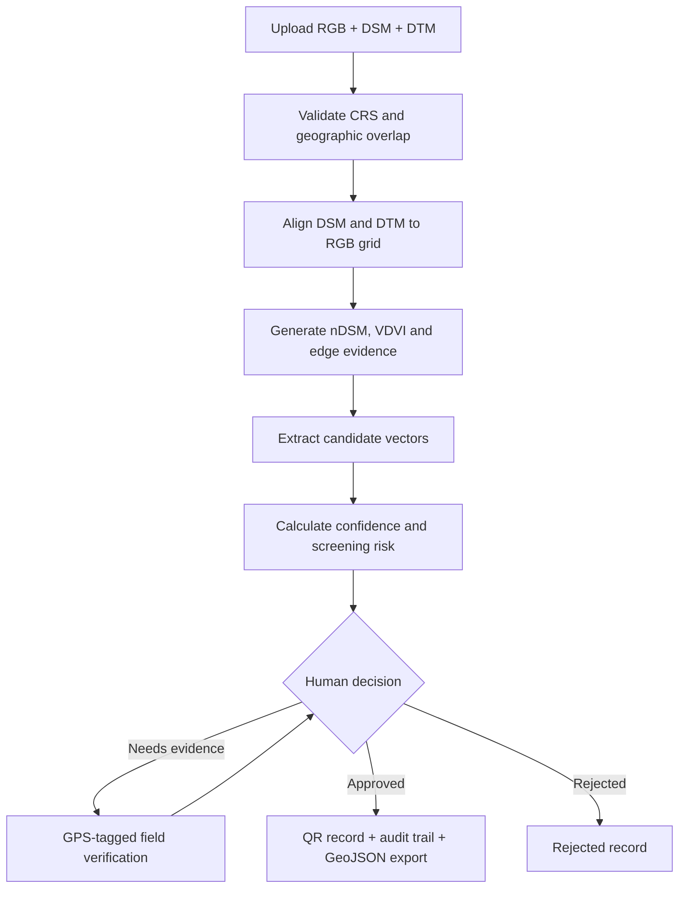

# Dharani 

### From aerial evidence to verified land records.

**Team PARSEK · Smart India Hackathon 2026 · Problem Statement 26012**

Dharani is a human-in-the-loop GeoAI prototype that converts georeferenced drone-survey data into reviewable land-use features. It accepts an RGB orthomosaic, a Digital Surface Model (DSM), and a Digital Terrain Model (DTM); aligns the rasters; extracts candidate buildings, vegetation, and surface corridors; calculates feature-level confidence and screening risk; and routes uncertain cases to field verification before approval.

The goal is not to replace surveyors. Dharani helps them focus their attention where it matters most while preserving human approval, field evidence, and a transparent audit trail.

> **Prototype status:** This repository contains a working decision-support prototype. Its risk indicators are screening alerts—not legal findings or authoritative cadastral boundaries.

## Why Dharani?

Many mapping workflows stop after drawing shapes from aerial imagery. In real land administration, that is only the beginning: imagery may be unclear, datasets may use different coordinate systems, extracted geometry may be uncertain, and sensitive cases require physical verification.

Dharani connects the complete workflow:

| Conventional workflow | Dharani |
|---|---|
| Manual inspection of every area | Prioritized review using confidence and risk |
| Misaligned rasters require preprocessing in another GIS tool | DSM and DTM are automatically aligned to the RGB grid |
| AI output may be accepted without explanation | Every feature includes evidence, confidence, risk, and a recommended action |
| Field observations remain separate from the map | GPS-tagged multilingual notes attach directly to the feature |
| Final geometry is difficult to retrieve in the field | Approved records receive a QR-linked map reference |
| Changes are difficult to trace | Processing and review actions appear in an audit trail |

## Key innovations

### 1. Color-Coded Trust Filter

Every extracted feature receives a geometry-confidence score and an easy traffic-light category:

- **Green — high confidence:** suitable for quick administrative review.
- **Yellow — medium confidence:** requires closer visual inspection.
- **Red — low confidence:** automatically prioritized for field verification.

The score combines available height, spectral, edge, shadow, and geometry evidence. It expresses how reliable the extracted shape appears—not whether the ownership claim is legally valid.

### 2. Explainable Risk Screening

Confidence and risk answer different questions:

- **Confidence:** “How certain is the system about this geometry?”
- **Risk:** “If this pattern is real, how urgently should a human inspect it?”

For example, a clearly visible structure may have high geometry confidence but still receive a high-priority alert because it touches a detected access corridor. Each alert contains a type, severity, numerical score, plain-language explanation, and recommended action.

### 3. Human-in-the-Loop Field Verification

Cases are sorted into a priority queue. A field officer can inspect the mapped evidence, capture the current GPS position, dictate or type a note in a selected language, and mark the feature as verified, rejected, or requiring field work. Browser speech recognition is available where supported.

### 4. QR-Linked Approved Records

After human approval, Dharani generates a QR code for the verified feature. It provides a fast bridge between a physical record and its corresponding digital geometry.

### 5. Transparent Audit Trail

Survey processing, field notes, and review decisions are recorded with timestamps and reviewer information. Approved data can be exported as GeoJSON for use in GIS software.

## End-to-end workflow



## The five-screen prototype

1. **Drone Input** — uploads the three mandatory georeferenced GeoTIFFs and explains validation requirements.
2. **Processing** — shows alignment, evidence generation, vector extraction, and trust-screening progress.
3. **Map Workspace** — displays RGB, nDSM, VDVI, classification, and extracted vectors in confidence, risk, or land-use mode.
4. **Field Verification** — provides a prioritized queue, feature evidence, GPS notes, language selection, speech-to-text, and review actions.
5. **Approved Records** — shows verified features, reviewer information, QR codes, audit events, and GeoJSON export.

## What the current prototype processes

### Inputs

| Input | Meaning | Minimum requirement |
|---|---|---|
| RGB orthomosaic | Georeferenced aerial/drone image | GeoTIFF with a CRS and at least 3 bands |
| DSM | Elevation of terrain and objects such as buildings/trees | Single-band GeoTIFF with a CRS |
| DTM | Bare-earth terrain elevation | Single-band GeoTIFF with a CRS |

RGB is the reference grid. DSM and DTM may have a different CRS, resolution, width, height, extent, or pixel origin; Dharani reprojects and resamples them automatically. The rasters must still describe the same survey area and use compatible height units. Inputs with less than 5% geographic overlap are rejected to prevent misleading output.

### Derived evidence

- **nDSM = DSM − DTM:** approximate object height above the local terrain.
- **VDVI:** visible-band vegetation evidence calculated from the RGB image.
- **Image-edge and shadow evidence:** supports geometry confidence estimation.
- **Classification preview:** color-coded building, vegetation, corridor, and background masks.
- **GeoJSON candidates:** clickable vector features containing evidence and review metadata.

### Extracted classes

In this project, a **class** means a mapped feature category. The prototype extracts:

- Building candidates
- Vegetation
- Surface-corridor candidates

Area statistics by class therefore mean the total mapped area belonging to each category—for example, the total square metres classified as buildings versus vegetation.

## Technology stack

| Layer | Technology | Purpose |
|---|---|---|
| Frontend | HTML, CSS, JavaScript | Five-screen responsive user interface |
| Web GIS | Leaflet + OpenStreetMap | Interactive geospatial visualization |
| Backend API | FastAPI + Pydantic | Upload, processing, review, notes, records, and exports |
| Geospatial processing | Rasterio + NumPy | GeoTIFF validation, reprojection, resampling, and raster calculations |
| Image processing | OpenCV + Pillow | Masks, morphology, evidence layers, and previews |
| Data exchange | GeoJSON | Feature geometry and attributes |
| QR generation | `qrcode` | QR-linked verified records |
| Testing | Pytest + HTTPX | API and end-to-end workflow tests |

## Project structure

```text
dharani-phase2/
├── app.py                         # FastAPI application and workflow APIs
├── processing.py                  # Raster alignment, evidence, extraction and scoring
├── requirements.txt               # Python dependencies
├── static/
│   ├── index.html                 # Five workflow screens
│   ├── styles.css                 # Interface styling
│   └── app.js                     # Map, uploads and review interactions
├── demo/
│   ├── generate_demo_inputs.py    # Recreates the learning GeoTIFF dataset
│   └── generated/                 # Ready-to-upload RGB, DSM and DTM files
├── data/
│   ├── parcels.geojson            # Built-in demonstration parcels
│   └── surveys/latest/            # Latest processed survey and audit data
└── tests/
    └── test_api.py                # API, raster alignment and workflow tests
```

## Quick start on Windows

### Prerequisites

- Windows 10 or 11
- Python **3.12**
- VS Code
- Internet access during dependency installation and for OpenStreetMap tiles

> Use Python 3.12 for this repository. The pinned geospatial dependencies may not provide compatible wheels for Python 3.14.

### 1. Open the project

Extract the repository, open the project folder in VS Code, and select **Terminal → New Terminal**.

### 2. Create and activate a virtual environment

Run each command once:

```powershell
py -3.12 -m venv .venv
Set-ExecutionPolicy -Scope Process -ExecutionPolicy Bypass
.venv\Scripts\Activate.ps1
```

Confirm that the environment is using Python 3.12:

```powershell
python --version
```

### 3. Install dependencies

```powershell
python -m pip install --upgrade pip
python -m pip install -r requirements.txt
```

### 4. Run the test suite

```powershell
python -m pytest -q
```

Expected result:

```text
7 passed
```

Deprecation warnings from third-party libraries are harmless for this prototype if all seven tests pass.

### 5. Start the application

```powershell
python -m uvicorn app:app --reload
```

Open [http://127.0.0.1:8000](http://127.0.0.1:8000) and keep the terminal running.

## Run the complete demo

The repository already includes three compatible sample files:

```text
demo/generated/demo_rgb.tif
demo/generated/demo_dsm.tif
demo/generated/demo_dtm.tif
```

If they are missing, recreate them with:

```powershell
python -m demo.generate_demo_inputs
```

Then:

1. Open **Drone Input**.
2. Select the RGB, DSM, and DTM files listed above.
3. Click **Validate and process survey**.
4. Watch the stages on **Processing**.
5. Inspect candidates and switch between **Confidence**, **Risk**, and **Land Use** in **Map Workspace**.
6. Open **Field Verification** and select a priority case.
7. Add a GPS-tagged field note, then approve, reject, or request field verification.
8. Open **Approved Records** to view the QR code and audit history.
9. Click **Export GeoJSON** to download the reviewed feature collection.

## API overview

FastAPI also exposes interactive documentation at [http://127.0.0.1:8000/docs](http://127.0.0.1:8000/docs) while the server is running.

| Method | Endpoint | Purpose |
|---|---|---|
| `GET` | `/api/health` | Service health check |
| `GET` | `/api/project` | Project identity and tagline |
| `POST` | `/api/surveys/upload` | Upload and process RGB, DSM, and DTM |
| `GET` | `/api/surveys/latest` | Latest survey metadata and statistics |
| `GET` | `/api/surveys/latest/features` | Extracted GeoJSON features |
| `GET` | `/api/surveys/latest/review-queue` | Prioritized human-review cases |
| `PATCH` | `/api/surveys/latest/features/{feature_id}/review` | Save a review decision |
| `POST` | `/api/surveys/latest/features/{feature_id}/field-notes` | Attach a GPS-tagged field note |
| `GET` | `/api/surveys/latest/approved` | Verified feature records |
| `GET` | `/api/surveys/latest/audit` | Processing and review history |
| `GET` | `/api/surveys/latest/features/{feature_id}/qr` | QR image for a verified feature |
| `GET` | `/api/surveys/latest/export` | Download the reviewed GeoJSON collection |

## Testing coverage

The automated tests cover:

- Health and project APIs
- Built-in parcel review behavior
- Real GeoTIFF processing
- Automatic alignment across different raster grids and coordinate systems
- Upload-to-review workflow
- GPS field notes and approval
- QR generation, audit history, and GeoJSON export

## Honest limitations and roadmap

The current extraction pipeline is a functional geospatial baseline based on height, visible-band, edge, morphology, and geometry rules. It does **not** claim to execute trained DeepLabV3+, LIGHT, or D-LinkNet checkpoints yet.

Those models remain appropriate next-stage components:

- **DeepLabV3+** for parcel/land-cover semantic segmentation and boundary evidence
- **LIGHT-style height-aware fusion** for combining RGB appearance with DSM-derived structure
- **D-LinkNet** for continuous road and narrow-corridor extraction using an encoder-decoder network with dilated convolutions

Planned engineering work:

1. Collect and label representative Indian drone imagery.
2. Train and calibrate segmentation models with held-out validation areas.
3. Replace rule-based masks with versioned model probability adapters.
4. Add authoritative cadastral and road-reference layers for actual overlap analysis.
5. Add vertex editing, topology validation, and change comparison.
6. Store users and survey history in a production database with role-based access.
7. Support offline field assignments and uploaded audio—not only browser speech-to-text.
8. Deploy over HTTPS so QR links are reachable from field devices.

## Important interpretation note

Dharani's outputs support survey and ground-truthing activities. A high risk score does not prove an encroachment, ownership dispute, or legal violation. Final land-record decisions must use authoritative records and approval by qualified government personnel.

## Team

Built by **Team PARSEK** for **Smart India Hackathon 2026 — PS 26012**.

**Dharani — From aerial evidence to verified land records.**
